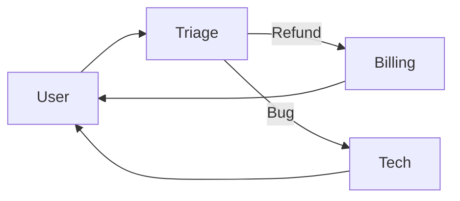

# Explanation: How Axon Works 🧠

## Philosophy

Axon is built on the **"Agent as a Function"** paradigm.
An agent is essentially a loop:
1.  **State:** History + Context
2.  **Input:** User Prompt
3.  **Process:** LLM Call -> Tool parsing -> Execution -> Recursion
4.  **Output:** Final Answer

## The Swarm Architecture

Axon Swarms use a **Handoff** mechanism. Instead of a central router (which is a bottleneck), agents talk to each other directly by returning a `Handoff` object.

This decentralized approach allows for complex, directed graphs of conversation flows.
